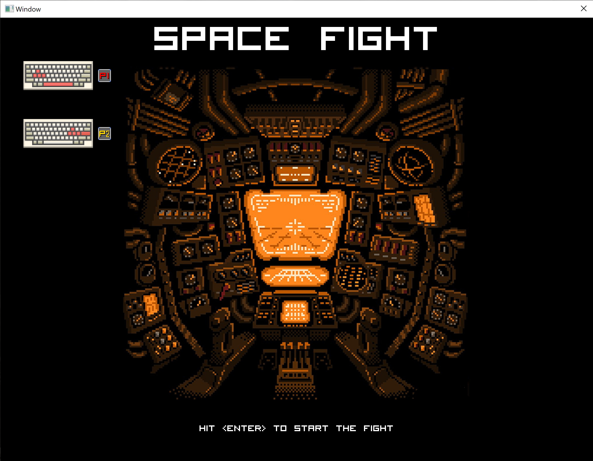
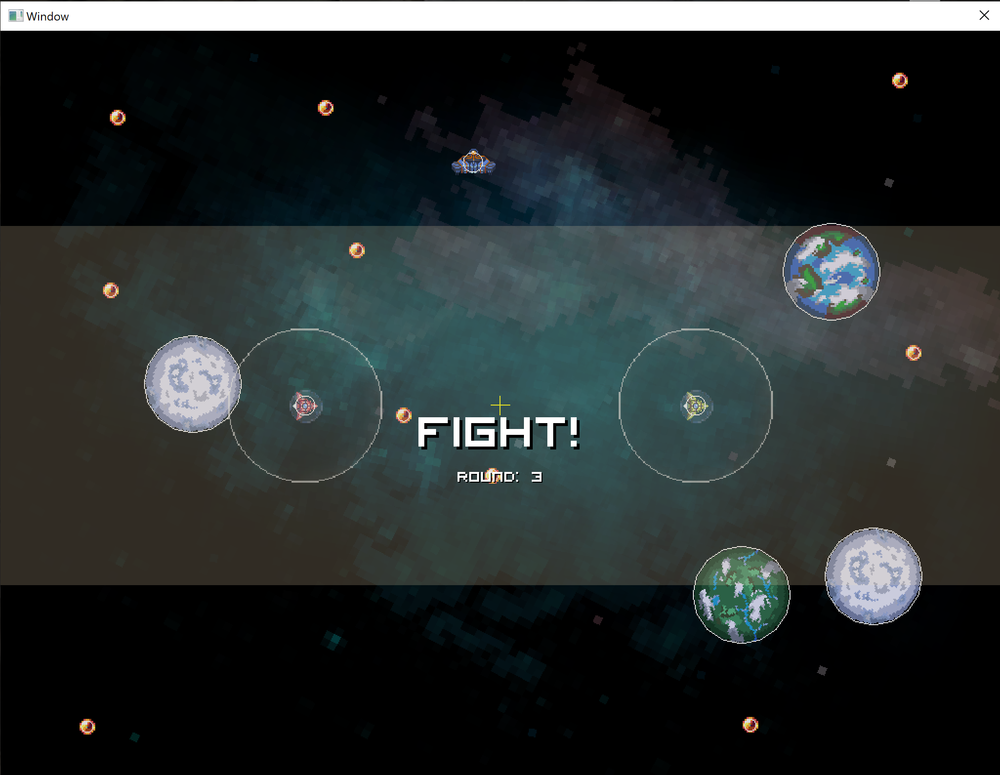
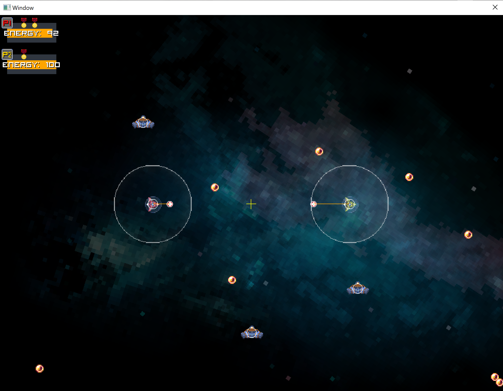

Example project for EnTT lib ( https://github.com/skypjack/entt ) and damn engine ( self made crossplatform 2D engine ).  
Shooter mechanic game prototype. 
  
## Description
  
This is a game for 2 or more players on one screen. Every player controls each own spaceship and the goal is to be the last survivor. 
Moving and shooting takes energy of the ship. Shooting has auto aiming. 
Energy could be regained by loading it from the space station. Every station has limited amount of energy. 
Also, energy could be collected from the shot bullets which are flies in space freely.
Without energy, the ship can't shoot and fly anymore and could be easily destoryed by enemy or pulled by the gravity of the nearby planet.
The player who efficiently save energy and apply tactics will win.

Controls are shown on the screenshot below.

## If you would like to participate 
There are several things you may do:
* Gamepad support. 
* More than two players multi-player support. 
* CSV config files for game tuning parameters.

     
Happy to see your pull requests :) 

